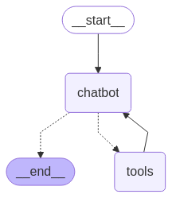

# 🤖 GroqGraph Agent: A Tool-Using Chatbot

**GroqGraph Agent** is a powerful and interactive chatbot built with Python, Langchain, LangGraph, and the Groq API. It showcases how to equip a Large Language Model (LLM) with the ability to use external tools, specifically Wikipedia and Arxiv, to answer queries and provide informative responses. The project uses the fast `Gemma2-9b-It` model via Groq for efficient inference.


*(This image shows the LangGraph execution flow where the chatbot can decide to use tools to gather information before responding.)*

---
## 🚀 Features

* **Conversational AI**: Engage in natural language conversations.
* **Tool Integration**: Seamlessly uses Wikipedia and Arxiv to find information.
    * **Wikipedia**: Fetches summaries from Wikipedia articles.
    * **Arxiv**: Retrieves information from scientific papers on Arxiv.
* **Powered by Groq**: Utilizes the Groq API for fast LLM inference with the `Gemma2-9b-It` model.
* **LangGraph Implementation**: Demonstrates the use of LangGraph to create a stateful, agentic chatbot capable of conditional tool use.
* **Langsmith Tracing**: Integrated for observability and debugging of the agent's execution flow (optional, requires Langsmith API key).

---
## ⚙️ How it Works

The chatbot operates based on a graph defined using LangGraph. Here's a simplified flow:

1.  **User Input**: The user sends a message to the chatbot.
2.  **Chatbot Node**: The core LLM (`Gemma2-9b-It` via Groq) receives the message. It decides whether it can answer directly or if it needs to use a tool.
3.  **Conditional Edge (Tool Use Check)**:
    * If the LLM decides to use a tool, the graph transitions to the `ToolNode`.
    * If no tool is needed, the LLM generates a response, and the graph might transition to the `END`.
4.  **Tool Node**: If a tool is invoked (e.g., `WikipediaQueryRun`, `ArxivQueryRun`), this node executes the tool with the parameters provided by the LLM.
5.  **Return to Chatbot**: The output from the tool is sent back to the `chatbot` node. The LLM then uses this new information to generate a final response.
6.  **End**: The chatbot provides the response to the user.

This cyclical process allows the chatbot to iteratively use tools until it has enough information to answer the user's query.

---
## 📋 Requirements

* Python 3.10+
* Jupyter Notebook or an IDE that supports `.ipynb` files
* An active Groq API Key
* (Optional) Langsmith API Key for tracing

---
## ▶️ Usage

1.  **Open the Jupyter Notebook:**
    ```bash
    jupyter notebook Chatbot_With_Tool.ipynb
    ```
    Or open it with your preferred IDE (e.g., VS Code with Python extension).

2.  **Run the cells sequentially:**
    * The initial cells import necessary libraries and set up the tools (Wikipedia and Arxiv wrappers).
    * API keys are loaded from the environment variables.
    * The LangGraph `StateGraph` is defined, along with the `chatbot` node and `tool_node`.
    * The graph edges and conditional logic for tool use are established.
    * The graph is compiled.
    * An optional cell attempts to display the graph structure.

3.  **Interact with the Chatbot:**
    Modify the `user_input` variable in the final code cell:
    ```python
    user_input = "What is the latest research on Large Language Models on Arxiv?"
    # Or try: "Who is Shah Rukh Khan?"

    events = graph.stream(
        {"messages": [("user", user_input)]}, stream_mode="values"
    )

    for event in events:
        event["messages"][-1].pretty_print()
    ```
    Run this cell to send your query to the chatbot. The output will show the conversation flow, including any tool calls and the final AI message.

---